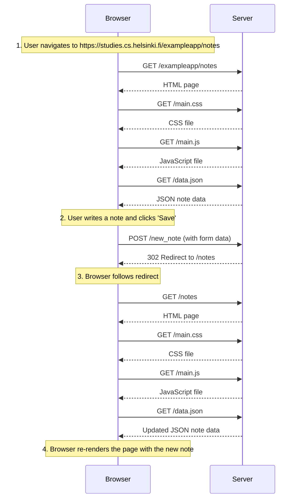

```mermaid

sequenceDiagram
  %% 1. User accesses the traditional notes app
  participant Browser
  participant Server

  Note over Browser: 1. User navigates to https://studies.cs.helsinki.fi/exampleapp/notes
  Browser->>Server: GET /exampleapp/notes
  Server-->>Browser: HTML page

  Browser->>Server: GET /main.css
  Server-->>Browser: CSS file

  Browser->>Server: GET /main.js
  Server-->>Browser: JavaScript file

  Browser->>Server: GET /data.json
  Server-->>Browser: JSON note data

  Note over Browser: 2. User writes a note and clicks 'Save'
  Browser->>Server: POST /new_note (with form data)
  Server-->>Browser: 302 Redirect to /notes

  Note over Browser: 3. Browser follows redirect
  Browser->>Server: GET /notes
  Server-->>Browser: HTML page

  Browser->>Server: GET /main.css
  Server-->>Browser: CSS file

  Browser->>Server: GET /main.js
  Server-->>Browser: JavaScript file

  Browser->>Server: GET /data.json
  Server-->>Browser: Updated JSON note data

  Note over Browser: 4. Browser re-renders the page with the new note
```
