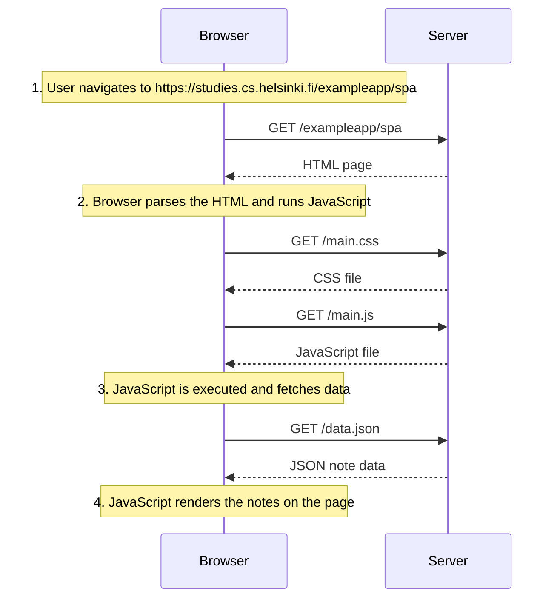

```mermaid

sequenceDiagram
  participant Browser
  participant Server

  Note over Browser: 1. User navigates to https://studies.cs.helsinki.fi/exampleapp/spa
  Browser->>Server: GET /exampleapp/spa
  Server-->>Browser: HTML page

  Note over Browser: 2. Browser parses the HTML and runs JavaScript
  Browser->>Server: GET /main.css
  Server-->>Browser: CSS file

  Browser->>Server: GET /main.js
  Server-->>Browser: JavaScript file

  Note over Browser: 3. JavaScript is executed and fetches data
  Browser->>Server: GET /data.json
  Server-->>Browser: JSON note data

  Note over Browser: 4. JavaScript renders the notes on the page
```
