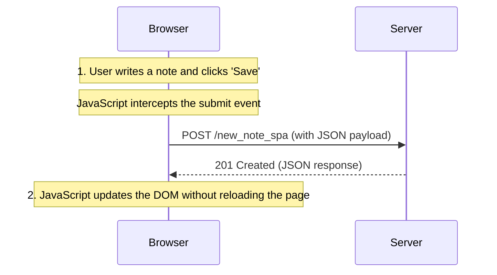

```mermaid

sequenceDiagram
  participant Browser
  participant Server

  Note over Browser: 1. User writes a note and clicks 'Save'
  Note over Browser: JavaScript intercepts the submit event
  Browser->>Server: POST /new_note_spa (with JSON payload)
  Server-->>Browser: 201 Created (JSON response)

  Note over Browser: 2. JavaScript updates the DOM without reloading the page
```
